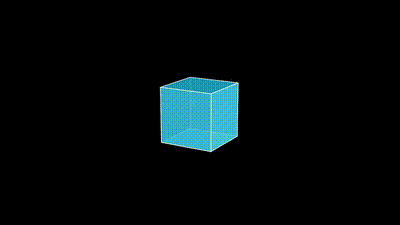

# manim-mcp

Text-to-video animation powered by [Manim](https://www.manim.community/) and Google Gemini. Describe what you want to see, and get a rendered animation back.

Works as a **CLI tool**, a **Gemini-powered agent**, or an **MCP server** for integration with AI assistants.

## Examples

| Circle to Square Transform | Rotating Cube |
|---------------------------|---------------|
| `manim-mcp gen "Transform a blue circle into a red square"` | `manim-mcp gen "Draw a rotating cube" -q high -f gif` |
|  |  |

## Quick Start

```bash
pip install -e .
```

### Prerequisites

- Python 3.11+
- [Manim](https://docs.manim.community/en/stable/installation.html) installed and on PATH
- A [Google Gemini API key](https://ai.google.dev/) set as `MANIM_MCP_GEMINI_API_KEY`
- Optional: ffmpeg (for thumbnails), LaTeX (for math text), S3/MinIO (for cloud storage)

### Environment Variables

Copy `.env.example` to `.env` and fill in your values:

```bash
MANIM_MCP_GEMINI_API_KEY=your-api-key
MANIM_MCP_GEMINI_MODEL=gemini-2.5-flash      # optional, default
MANIM_MCP_S3_ENDPOINT=localhost:9000          # optional, for S3 storage
MANIM_MCP_S3_ACCESS_KEY=minioadmin            # optional
MANIM_MCP_S3_SECRET_KEY=minioadmin            # optional
MANIM_MCP_S3_BUCKET=manim-renders             # optional
MANIM_MCP_S3_SECURE=false                     # optional
```

## Usage

### Generate an animation

```bash
manim-mcp generate "Explain the Pythagorean theorem with a visual proof"
manim-mcp gen "Draw a rotating cube" --quality high --format gif
```

### Generate with audio narration

Add `--audio` to generate spoken narration using Gemini TTS:

```bash
manim-mcp generate "Explain the quadratic formula" --audio
manim-mcp gen "Show a bouncing ball" --audio --voice Kore
```

Available voices: Puck, Charon, Kore, Fenrir, Aoede, and [more](https://ai.google.dev/gemini-api/docs/speech-generation).

### Edit an existing animation

```bash
manim-mcp edit <render_id> "Make the circle red and add axis labels"
```

### List, inspect, delete renders

```bash
manim-mcp list --status completed --limit 10
manim-mcp ls
manim-mcp get <render_id>
manim-mcp delete <render_id> --yes
manim-mcp rm <render_id> -y
```

### Agent mode

Let Gemini interpret a multi-step request and chain tool calls:

```bash
manim-mcp prompt "Create a video on the quadratic formula, then edit it with blue colors"
manim-mcp prompt "List my renders and delete any failed ones" --max-turns 15
```

### MCP server

Start the Model Context Protocol server for integration with Claude, Cursor, or other MCP clients:

```bash
manim-mcp serve
manim-mcp serve --transport stdio
manim-mcp serve --transport sse
```

### Global flags

```
--json       Machine-readable JSON output
--verbose    Debug logging
```

## Docker

Run with MinIO for S3 storage:

```bash
export MANIM_MCP_GEMINI_API_KEY=your-api-key
docker compose up
```

This starts the MCP server on port 8000 with MinIO on ports 9000/9001.

## MCP Tools

When running as an MCP server, the following tools are available:

| Tool | Description |
|------|-------------|
| `generate_animation` | Create an animation from a text prompt |
| `edit_animation` | Edit an existing animation with instructions |
| `list_renders` | List past renders with pagination and filtering |
| `get_render` | Get full details and a fresh download URL |
| `delete_render` | Permanently delete a render and its files |

## Architecture

```
prompt → Gemini LLM → Python code → AST validation → Manim render → S3 upload → URL
```

- **GeminiClient** generates Manim Scene code from text prompts
- **CodeSandbox** validates code via AST analysis (blocks dangerous imports/builtins)
- **ManimRenderer** executes manim in isolated temp directories with concurrency control
- **S3Storage** uploads to MinIO/S3 with presigned URLs
- **RenderTracker** persists job metadata in SQLite

## Development

```bash
pip install -e ".[dev]"
pytest
```

## License

MIT
